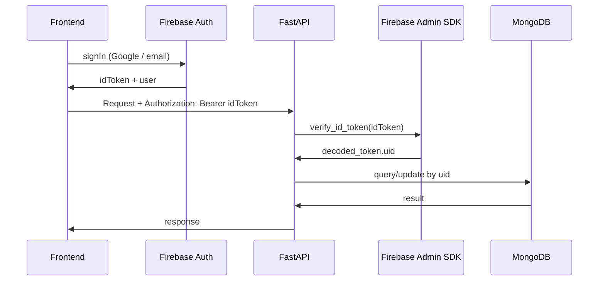

# Firebase to FastAPI + MongoDB migration

## Current state (summary)

- **Auth**: Firebase Auth (Google + email/password) — **unchanged**; frontend keeps using it.
- **Data**: Firestore `users/{uid}/products|clients|suppliers|orders` + top-level `users/{uid}` doc — **move to MongoDB**.
- **Realtime**: Four `onSnapshot` listeners (products, clients, suppliers, orders) — **replace with WebSockets**.
- **Mutations**: 17 callable functions called via `httpsCallable` from [productSupplierClientContextProvider.tsx](src/contexts/productSupplierClientContextProvider.tsx) and [userServices.tsx](src/contexts/userServices.tsx) — **become FastAPI REST endpoints**.
- **Files**: Product images in Firebase Storage — **keep for now** (backend-api can still upload via Firebase Admin SDK).

No existing HTTP webhooks; “webhooks” clarified as **WebSockets** for realtime.

---

## 1. New backend folder and stack

- **Folder**: `backend-api/` at repo root (sibling to `backend/` and `src/`).
- **Stack**: FastAPI, PyMongo (or Beanie for ODM), Firebase Admin SDK (auth verify + optional storage), WebSockets, Uvicorn.
- **Config**: Env vars for `MONGODB_URI`, Firebase project/service account (for token verification and, if kept, storage).

---

## 2. Firebase Auth with MongoDB (how it works)

- Frontend continues using Firebase Auth only for login/signup; no change to auth UX.
- Every FastAPI request sends the Firebase ID token (e.g. `Authorization: Bearer <idToken>`). FastAPI verifies it with the Firebase Admin SDK and gets `uid`.
- All MongoDB reads/writes are scoped by `uid` (same as current Firestore layout). No need to migrate existing user data; new data will be stored in MongoDB. Existing users keep using the same `uid` from Firebase Auth when they hit the new API.

**User profile**: Today `createUserDoc` writes to Firestore and `fetchUserData` in [authContexts.tsx](src/contexts/authContexts.tsx) reads from Firestore. After migration:

- Add a FastAPI endpoint (e.g. `POST /users/me` or `PUT /users/me`) that creates/updates a user profile document in MongoDB (name, email, photo, uid) from the token + body.
- Frontend calls this after sign-in (same flow as current `createUserDoc`).
- `fetchUserData` becomes a `GET /users/me` that returns the MongoDB user document (or 404); optionally fallback to token claims so profile works even before the document exists.

---

## 3. MongoDB data model

- **Collection per entity**, documents keyed by `userId` (Firebase `uid`):
   - `users`: `{ _id, uid, name, email, photo, createdAt, role }` (optional `_id` or use `uid` as `_id`).
   - `products`: `{ _id, productId, userId, image, productChineseName, ... }` (all fields from [backend/functions/src/types/types.ts](backend/functions/src/types/types.ts)).
   - `clients`: `{ _id, clientId, userId, companyName, productIds, ... }`.
   - `suppliers`: `{ _id, supplierId, userId, supplierName, productIds, ... }`.
   - `orders`: `{ _id, orderId, userId, orderName, clientId, products, status, ... }`.
- Indexes: `userId`, `userId + productId/clientId/supplierId/orderId` as needed for queries and WebSocket “broadcast to user” usage.

---

## 4. Backend-api scope (migrate everything)

| Current (Firebase)                                             | New (FastAPI)                                                                                                      |
| -------------------------------------------------------------- | ------------------------------------------------------------------------------------------------------------------ |
| createUserDoc                                                  | POST/PUT `/users/me` (create/update profile in MongoDB)                                                            |
| createProduct, editProduct, deleteProducts, saveUnsavedProduct | POST/PATCH/DELETE `/products`, PATCH `/products/{id}/save`                                                         |
| addClient, editClient, deleteClient, updateClientProducts      | POST/PATCH/DELETE `/clients`, PATCH `/clients/{id}/products`                                                       |
| addSupplier, editSupplier, deleteSupplier                      | POST/PATCH/DELETE `/suppliers`                                                                                     |
| createOrder, editOrder, deleteOrder, updateOrderState          | POST/PATCH/DELETE `/orders`, PATCH `/orders/{id}/state`                                                            |
| syncAll                                                        | POST `/sync` (bulk write suppliers, clients, products)                                                             |
| (no equivalent)                                                | GET `/products`, `/clients`, `/suppliers`, `/orders` for initial load / list                                       |
| onSnapshot x4                                                  | Single WebSocket endpoint (e.g. `/ws`) that pushes updates for products, clients, suppliers, orders for that `uid` |

- **Image uploads**: In createProduct, editProduct, syncAll the backend currently uploads to Firebase Storage. Keep the same: backend-api uses Firebase Admin SDK (same bucket) to upload and store the same kind of URL in MongoDB. No change to frontend image URLs if you keep the same bucket.
- **Validation**: Replicate the same validation and error messages (e.g. 客户不存在, 供应商不存在) from the existing functions in [backend/functions/src](backend/functions/src).

---

## 5. WebSockets (replace onSnapshot)

- **Single endpoint** e.g. `WS /ws?token=<firebase-id-token>` (or send token in first message). Server verifies token, gets `uid`, associates the connection with that user.
- **Server behavior**: On any write to products/clients/suppliers/orders for a given `uid`, broadcast a message to all WebSocket connections for that `uid` (e.g. `{ type: "products" }`, `{ type: "clients" }`, etc.). Client can then refetch that resource or you can include a small payload (e.g. “updated” ids).
- **Client**: In [productSupplierClientContextProvider.tsx](src/contexts/productSupplierClientContextProvider.tsx), replace the four `onSnapshot` effects with one WebSocket connection; on message, update the corresponding state (firestoreProducts, firestoreClients, firestoreSuppliers, orders) and optionally refetch the relevant list from REST or from the payload.

---

## 6. Frontend connection changes

- **Base URL**: Configure backend-api base URL (e.g. `VITE_API_URL` or `REACT_APP_API_URL`).
- **Auth header**: After Firebase sign-in, get the ID token with `user.getIdToken()` (or `getIdToken(true)` when needed) and send `Authorization: Bearer <token>` on every request. Optionally a small API client that refreshes the token and attaches the header.
- **Replace callables**: In [productSupplierClientContextProvider.tsx](src/contexts/productSupplierClientContextProvider.tsx) and [userServices.tsx](src/contexts/userServices.tsx), replace each `httpsCallable(functions, "createProduct")` (etc.) with `fetch(apiUrl + "/products", { method: "POST", headers: { Authorization:` Bearer ${token} `}, body: JSON.stringify(...) })` (or axios). Map each function to the right method and path as in the table above.
- **Replace Firestore reads**:
   - **getClients / getSuppliers**: Use `GET /clients` and `GET /suppliers` (with auth) instead of `getDocs(collection(db, "users", uid, "clients"))`.
   - **fetchUserData**: Use `GET /users/me` instead of `getDoc(doc(db, "users", uid))`.
- **Replace onSnapshot with WebSocket**: Single `useEffect` that opens `WS /ws?token=...`, stores the socket in state or ref, and on message updates the four state slices (products, clients, suppliers, orders) and triggers any needed refetches or direct state updates.
- **Firestore/Functions imports**: Remove `getFunctions`, `httpsCallable`, `onSnapshot`, `collection`, `getDocs`, `doc`, `getDoc`, `setDoc` from the data layer; keep Firestore only if you still use it for something (e.g. analytics). Keep Firebase Auth and Storage client usage as-is if storage is unchanged.

---

## 7. Order of implementation (suggested)

1. **Scaffold backend-api**: FastAPI app, CORS, env, Firebase Admin init, dependency that verifies token and returns `uid`.
2. **MongoDB**: Connect, collections, indexes, and helper functions for products/clients/suppliers/orders/users by `uid`.
3. **User profile**: `GET /users/me`, `POST or PUT /users/me` (create/update from token + body).
4. **Products**: CRUD + save endpoint; keep Firebase Storage upload in FastAPI for create/edit/sync.
5. **Clients**: CRUD + update productIds.
6. **Suppliers**: CRUD.
7. **Orders**: CRUD + update state.
8. **Sync**: `POST /sync` (bulk suppliers, clients, products with image uploads).
9. **WebSocket**: `/ws` with token auth, broadcast on write for each entity type per `uid`.
10.   **Frontend**: API client + auth header; replace all callables and Firestore reads/listeners with REST + WebSocket; keep Firebase Auth (and Storage if unchanged).

---

## 8. What stays on Firebase

- **Auth**: Sign-in, sign-up, token issuance (frontend only); FastAPI only verifies tokens.
- **Storage**: Product images (optional to migrate later); backend-api continues uploading via Admin SDK if you keep it.
- **Existing backend**: `backend/functions/` can remain for a transition period or be removed once frontend is fully on backend-api.

---

## 9. Risks / notes

- **Token refresh**: Frontend should refresh the ID token before expiry when holding long-lived WebSocket connections; otherwise the socket may be closed after token expiry if you re-verify.
- **CORS**: Allow the frontend origin (e.g. `https://fulcrums.ca` and dev origin) in FastAPI CORS.
- **Dexie**: You still use Dexie for clients/suppliers; ensure the new flow (REST + WebSocket) still populates the same state that Dexie merges with, or adjust merge logic as needed.

If you want, next step is to break this into concrete file-level todos (e.g. “add `backend-api/app/deps.py` with `get_uid_from_token`”, “add GET/POST /products in `backend-api/app/routers/products.py`”) and then implement step by step.
